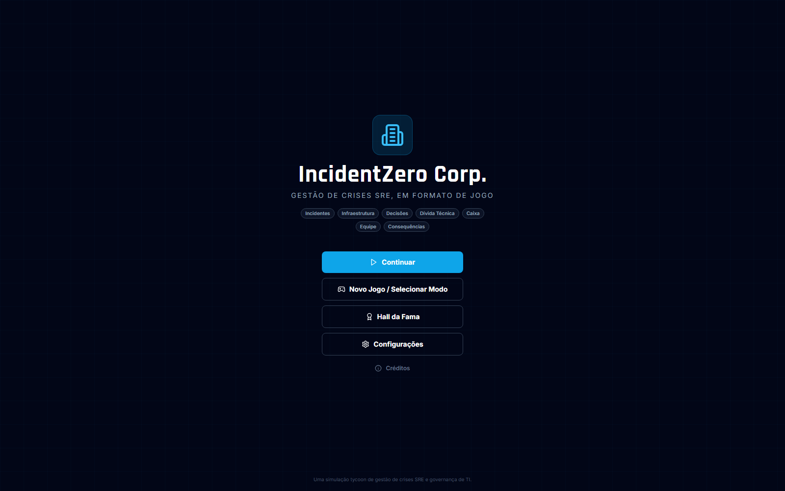
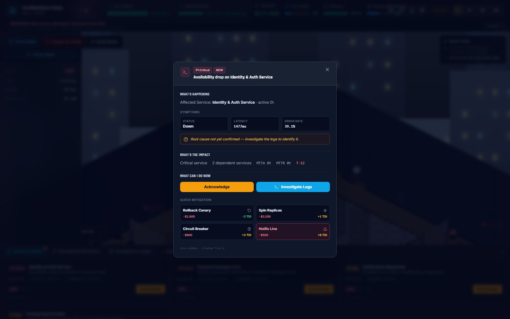
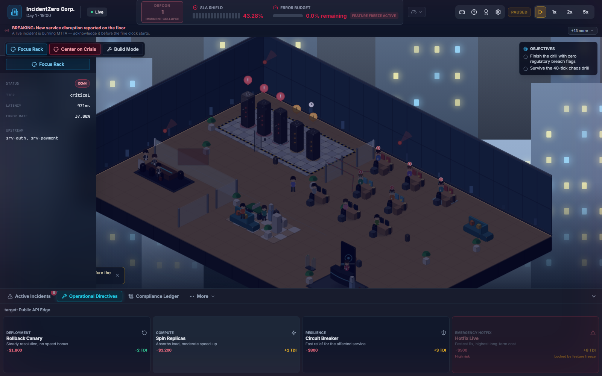
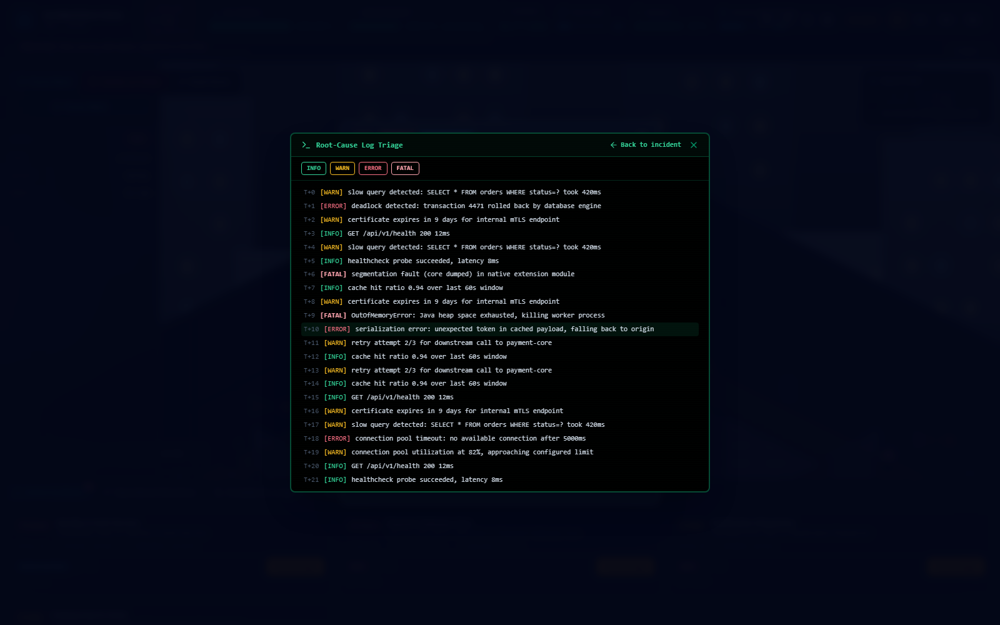
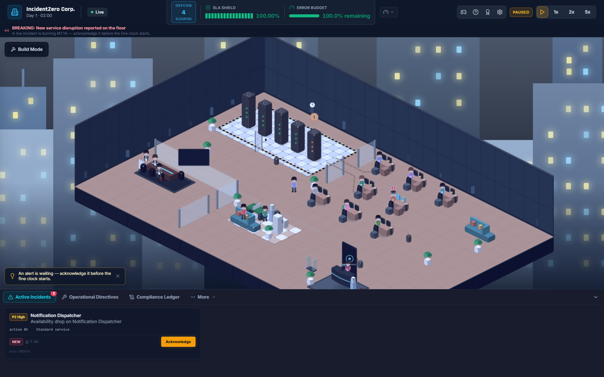
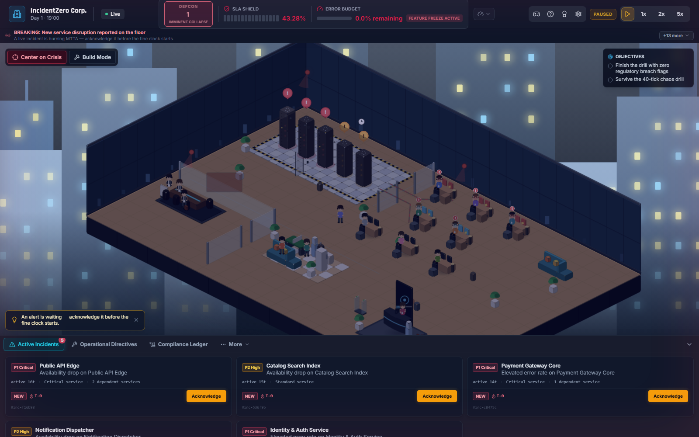
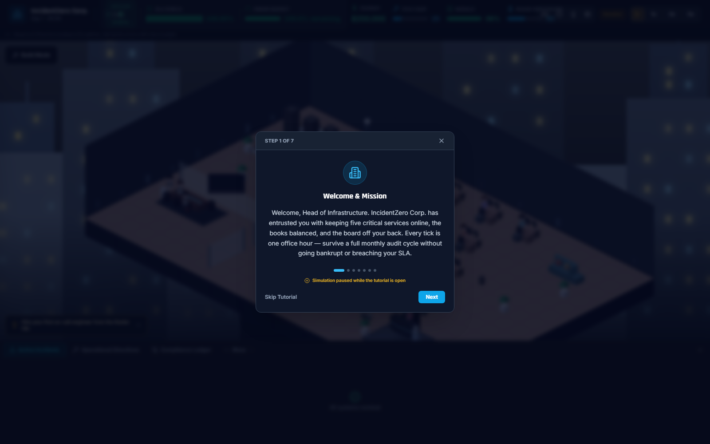

# INCIDENTZERO: SRE & IT GOVERNANCE SIMULATOR


[](https://github.com/christiansousadev/simulator-crisis/actions/workflows/ci.yml)
[](./LICENSE)
[](./frontend)
[](./backend)

**Language:** 🇺🇸 **English** (default) · [🇧🇷 Português](./README.pt-BR.md)

> **"Silence the alarms. Defend the SLA. Survive the audit."**

IncidentZero is a real-time tactical operations and systems reliability strategy game. As Head of Infrastructure / VP of Engineering, balance high availability, latency, cascading microservice outages, runbook mitigations, technical debt accumulation, on-call staffing, and compliance audits under live operational fire — all rendered as a living isometric office.

The core gameplay loop mirrors production incident lifecycle:
**Incident Trigger → Detection → Acknowledgment (MTTA) → Investigation (Log Triage) → Root-Cause Diagnosis → Mitigation (Runbooks) → Operational Consequences → Resolution (MTTR) → Post-Mortem Dossier → Compliance Audit → Career Progression**.

---

## Screenshots



<table>
<tr>
<td width="33%"></td>
<td width="33%"></td>
<td width="33%"></td>
</tr>
<tr>
<td align="center"><sub>Incident Detail (Tri-Block)</sub></td>
<td align="center"><sub>Runbook Mitigations</sub></td>
<td align="center"><sub>CRT Log Triage</sub></td>
</tr>
<tr>
<td width="33%"></td>
<td width="33%"></td>
<td width="33%"></td>
</tr>
<tr>
<td align="center"><sub>Active Incident on Floor</sub></td>
<td align="center"><sub>Critical Crisis (DEFCON 1)</sub></td>
<td align="center"><sub>Guided Onboarding</sub></td>
</tr>
</table>

---

## Core Features & Mechanics

### 1. Operations & Cascade Simulation
- **Interdependent Microservices:** Core 5-microservice dependency graph with dynamic infrastructure nodes, where upstream service degradation cascades to downstream dependencies based on latency and failure thresholds.
- **Incident Lifecycle (P1 to P4):** Severities drive MTTA/MTTR penalties, incident surcharges, and customer satisfaction / team morale (`user_happiness`) erosion.
- **Root-Cause Investigation:** Root causes remain masked under operational fog-of-war until an operator conducts log triage or assigns engineering investigation.
- **Interactive Log Triage:** Retro CRT terminal drawer streaming timestamped logs with ERROR/WARN/INFO filters; selecting actionable log evidence confirms the root cause and unlocks high-confidence mitigations.
- **Context-Aware Runbooks:** Mitigations feature execution costs, deterministic mitigation effectiveness based on cause compatibility (`formulas.MITIGATION_EFFECTIVENESS` with a 0.70 threshold for full resolution), technical debt index (TDI) deltas, cooldown periods, and operational restrictions.

### 2. SRE Metrics & Governance
- **Rolling Window SLA:** Evaluated continuously over a sliding window of up to 720 samples (1 sample per in-game hour/tick). Targets a 99.90% SLO benchmark (`SLA_BENCHMARK`); dropping below the 99.00% regulatory breach threshold (`SLA_BREACH_THRESHOLD`) after the 24-tick grace period (`BREACH_GRACE_TICKS`) triggers an official regulatory sanction (`SLA_BREACH_EMERGENCY_SANCTION`), flagging non-compliance without immediately ending the run.
- **Error Budget & Feature Freeze:** Derived from the 99.90% SLO (total error budget of 0.10%). When the error budget is depleted (0%), an automated feature freeze engages, temporarily restricting operations to remediation runbooks until availability recovers.
- **Cash Runway & Bankruptcy:** Operational overhead (server compute, cloud bills, engineering salaries, and audit fines) drains cash reserves. Reaching zero cash ($0.00) triggers terminal financial liquidation (`BANKRUPTCY_LIQUIDATION`), ending the run immediately.
- **Technical Debt Index (TDI):** Hasty patches and emergency workarounds increase TDI, applying an ongoing interest penalty to MTTR and increasing future incident hazard rates.
- **Board Reputation & CAB Dilemmas:** Periodic Change Advisory Board trade-offs (budget vs. tech debt vs. morale vs. reputation) with persistent board standings that modulate incident frequencies.

### 3. Staffing & On-Call Management
- **Engineer Hiring:** Recruit engineers across 4 core competencies matching service specializations: Authentication (`auth`), Payments (`payments`), API Gateway & Messaging (`gateway`), and Databases (`db`).
- **On-Call Rotations & Fatigue:** Balance active shifts and rest cycles; sustained incident handling depletes stamina and elevates stress, causing operational mistakes and slower MTTR.

### 4. Infrastructure & Tech Tree Upgrades
- **Tech Tree Upgrades:** Unlock and deploy capabilities across three branches:
  - *Observability:* APM Distributed Tracing, Predictive Anomaly Detection, Real User Monitoring (RUM).
  - *Resilience:* Multi-AZ Failover, Auto-Scaling Clusters, Circuit Breakers, Chaos Automation.
  - *Facilities:* Backup Generators, Ergonomic Workstations, Coffee Stations (morale regeneration).
- **Build Mode:** Modular infrastructure placement and server rack scaling directly on the office floor.

### 5. Scripted Scenarios & Game Modes
- **Sandbox Mode:** Unconstrained freeform simulation with customizable difficulty presets (Intern / Standard / Chaos).
- **Black Friday Rush:** Extreme consumer traffic spikes and database connection exhaustion under tight SLA constraints.
- **Chaos Engineering Drill:** Scheduled automated failure injections testing multi-AZ failover and architectural resilience.
- **Ransomware Infiltration:** Cyber crisis requiring fast outbound lateral movement isolation, forensic log analysis, and clean snapshot restoration.
- **Custom Chaos Scenarios:** Built-in scenario loader and editor supporting validated JSON configurations for custom hazard rates, failure rules, and scripted chaos events.

### 6. Post-Incident Dossier, Audit & AI Auditor
- **Unified Incident Dossier:** Comprehensive incident record aggregating forensic timelines, MTTA/MTTR metrics, financial damage, and remediation actions.
- **Compliance-Oriented Post-Mortems:** Generates structured post-mortems aligned with SOX-404 and SOC 2 style governance controls in Markdown and executive branded PDF formats, protected by SHA-256 **content checksums** for audit trail integrity verification.
- **AI Auditor Defense Interview:** Interactive post-incident compliance defense session where an AI compliance auditor interrogates the operator about response delays, runbook choices, and preventative measures. All financial penalties or waivers proposed by the AI are verified and enforced by the server backend with strict idempotency.

### 7. Career Progression & Replayability
- **Persistent Career Records:** Detailed historical records (`CareerRecord`) storing scenario outcomes, difficulty, SLA performance, days survived, and prestige points in SQLite.
- **Hall of Fame:** Permanent local career dashboard tracking personal bests, historical runs, and performance statistics across playthroughs.
- **Achievements & Operational Ranks:** 12 unlockable achievements and 5 tiered Operational Ranks earned through governance excellence.
- **Cosmetics & Dynamic Challenges:** Unlockable isometric office aesthetics and automated next-challenge recommendations derived from player progression, completed scenarios, difficulty history, and pending achievements.

---

## Tactical War Room & Game Feel

- **Living Isometric Office:** Rendered canvas/SVG isometric perspective with smooth zoom, pan, and contextual on-demand focus ("Focus Rack" and "Center on Crisis" controls, plus click-to-focus on affected service racks).
- **Dynamic Server Rack States:** Real-time rack visualization reflecting operational status (healthy, degraded, down, investigating, mitigating) with LED telemetry and pulsating emergency alarm beacons.
- **Visual Severity & Crisis Feedback:** DEFCON alert levels (1 to 5) triggering room lighting transitions, emergency vignette pulsations, and corporate breaking news ticker updates.
- **Tactile HUD:** Real-time animated gauges for SLA, Error Budget, Cash Runway, Technical Debt, and Team Morale, paired with floating combat text indicating MTTR and cost adjustments.
- **In-Game Flow Modals:** Integrated Scenario Briefing, Tri-Block Incident Details, CRT Log Terminal Drawer, Incident Resolution Summary banners, and Post-Match Debrief modals.
- **Procedural Audio & Accessibility:** Web Audio API sound synthesis generating distinct tones for DEFCON transitions, runbook executions, alarm hums, and UI feedback, with comprehensive support for `prefers-reduced-motion` and high-contrast colorblind modes.

---

## Server-Authoritative Architecture & Resilience

IncidentZero enforces a **Server-Authoritative Architecture**:
- The backend FastAPI simulation engine is the single source of truth for all mathematical models, SLA rolling calculations, financial ledger balances, incident lifecycle transitions, and scenario objective evaluations. The frontend operates as a responsive tactical client.
- **Session Resilience & Persistence:** Active game states are periodically persisted as atomic snapshots in SQLite. Server restarts or page reloads seamlessly restore the simulation without losing active incidents, investigation progress, purchased upgrades, cooldowns, RNG seed determinism, or the rolling SLA sample buffer.

---

## Architecture Overview

- **Frontend:** React 18, Vite, TypeScript, Tailwind CSS, Lucide Icons, Zustand state management, WebSocket client. Tested via Vitest and Playwright.
- **Backend:** Python 3.12, FastAPI, deterministic tick loop engine (1 tick = 1 virtual hour), SQLAlchemy, SQLite, Pydantic v2. Tested via pytest.
- **Database Migrations:** [Alembic](https://alembic.sqlalchemy.org/) manages schema versions and runs automatic migrations on startup (`alembic upgrade head`).
- **Telemetry Stream:** Bidirectional WebSocket (`/ws/telemetry`) streaming live tick deltas, rack states, metrics, and incident notifications.
- **Compliance Audit Ledger:** Immutable SQLite event log tracking 29 distinct governance and operational event types.
- **AI Integration (Optional):** Pluggable compliance auditor supporting OpenAI, Anthropic, or an offline deterministic fallback engine.

See [ARCHITECTURE.md](./ARCHITECTURE.md) for complete technical blueprints, mathematical formulas, and database schemas.

---

## Quickstart

### Option A — One-Shot Start Scripts

```bash
# Windows PowerShell
.\start.ps1

# macOS / Linux / Git Bash
./start.sh
```

Both scripts verify prerequisites, set up the backend virtual environment, install Python and Node dependencies, and concurrently launch the FastAPI and Vite development servers.

### Option B — Docker Compose

```bash
docker compose up --build
```

### Option C — Manual Setup (Two Terminals)

**Backend Terminal**
```bash
cd backend
python -m venv .venv
.\.venv\Scripts\activate        # Windows
# source .venv/bin/activate     # Linux / macOS
pip install -r requirements.txt
uvicorn app.main:app --reload --port 8000
```
*Database migrations run automatically on startup via Alembic.*

**Frontend Terminal**
```bash
cd frontend
npm install
npm run dev
```

- Open `http://localhost:5173` to access the War Room.
- Interactive backend API documentation (Swagger UI) is available at `http://localhost:8000/docs`.

---

## Database Migrations

Schema evolution is fully automated via Alembic:
- On every backend boot, `app/main.py` executes `alembic upgrade head` before the simulation engine starts.
- When modifying SQLAlchemy models, generate a migration revision before restarting:
  ```bash
  cd backend
  alembic revision --autogenerate -m "describe schema change"
  ```
- If an existing database lacks an `alembic_version` table (legacy database pre-Alembic), the backend aborts with a clear prompt to remove the outdated database file.

---

## Testing & Quality Assurance

```bash
# Backend — from backend/ with active virtualenv
ruff check .                                        # Static linting
pytest tests/ -v                                     # Full unit & integration test suite
pytest tests/ --cov=app --cov-report=term-missing    # Test coverage analysis

# Frontend — from frontend/
npm run lint           # ESLint analysis
npx tsc --noEmit       # TypeScript type check
npm test               # Vitest unit test suite
npm run test:coverage  # Vitest test coverage
npm run build          # Production bundle build

# End-to-End Suite — from frontend/ with backend virtualenv available
npm run test:e2e       # Playwright E2E suite driving live servers and WebSocket
```

The Playwright test suite (`frontend/e2e/`) verifies real browser interactions against live backend and WebSocket instances without mocking. CI executes all linting, unit tests, type checks, and E2E suites on every pull request (`.github/workflows/ci.yml`).

---

## Key API Endpoints

The backend provides 30+ REST endpoints across 13 domain routers in addition to the live WebSocket stream. Explore the interactive documentation at `http://localhost:8000/docs`.

| Router | Base Path | Description |
|---|---|---|
| Sessions | `/api/session/*`, `/api/health` | Simulation lifecycle (start/pause/reset), speed control, state snapshots |
| Services | `/api/services` | Service mesh topology and health status |
| Incidents | `/api/incidents/*` | Incident streams, acknowledgment, investigation, log triage |
| Mitigations | `/api/mitigations/*` | Runbook mitigation catalog and execution |
| Audits | `/api/audits/*` | Compliance audit ledger, Markdown/PDF post-mortems, AI defense interview |
| Upgrades | `/api/upgrades/*` | Tech tree upgrades across Observability, Resilience, and Facilities |
| Dilemmas | `/api/dilemmas/*` | Change Advisory Board (CAB) dilemma options and resolution |
| Staff | `/api/staff/*` | Engineer hiring, competency management, shift rotations |
| Scenarios | `/api/scenarios/*` | Scripted scenario catalog, active scenario state, custom scenario builder |
| Infrastructure | `/api/infrastructure/*` | Build-mode node catalog, rack placement, and removals |
| Achievements | `/api/achievements/*` | Achievement catalog, unlock evaluations |
| Cosmetics | `/api/cosmetics/*` | Office cosmetic catalog and prestige-point purchases |
| Career | `/api/career/*` | Hall of Fame records, career summary, personal bests, next challenges |
| Telemetry | `/ws/telemetry` | Real-time WebSocket stream for simulation ticks and telemetry |

---

## Technical Documentation & Reference

For comprehensive technical specifications and architecture blueprints, refer to:
- [ARCHITECTURE.md](./ARCHITECTURE.md) — System architecture, mathematical models, and database schema.
- [`audits/docs/01_SYSTEM_ARCHITECTURE_AND_DATA_FLOW.md`](./audits/docs/01_SYSTEM_ARCHITECTURE_AND_DATA_FLOW.md) — Core engine data flows and WebSocket protocol.
- [`audits/docs/02_MATHEMATICAL_ENGINE_AND_SLA_SPECIFICATION.md`](./audits/docs/02_MATHEMATICAL_ENGINE_AND_SLA_SPECIFICATION.md) — Rolling SLA window, MTTA/MTTR, and financial formulas.
- [`audits/docs/03_GOVERNANCE_AND_COMPLIANCE_CONTROLS.md`](./audits/docs/03_GOVERNANCE_AND_COMPLIANCE_CONTROLS.md) — Audit logging, SOX-404 / SOC2 controls, and AI interview safety.
- [`audits/docs/04_RUNBOOK_CATALOG_AND_MITIGATION_MATRIX.md`](./audits/docs/04_RUNBOOK_CATALOG_AND_MITIGATION_MATRIX.md) — SRE runbook mitigation catalog and effect matrix.
- [`audits/docs/05_POST_MORTEM_STANDARD_OPERATING_PROCEDURE.md`](./audits/docs/05_POST_MORTEM_STANDARD_OPERATING_PROCEDURE.md) — Post-mortem generation SOP, dossiers, and PDF checksums.

---

## Project Structure

```
simulator-crisis/
├── backend/            FastAPI server: engine, models, schemas, api/v1 routers, alembic migrations, tests
├── frontend/           React + Vite + TypeScript dashboard, i18n (en/pt-BR/es), Vitest and Playwright e2e suites
├── audits/             Post-mortem templates, generated reports, and detailed technical specifications (audits/docs/)
├── docs/screenshots/   Official war-room screenshots
├── .github/            CI/CD GitHub Actions workflows, Dependabot, and issue templates
├── LICENSE             MIT License
├── SECURITY.md         Security policy and vulnerability reporting
├── CHANGELOG.md        Version history and feature release notes
├── ARCHITECTURE.md     Complete system blueprint and design specification
└── README.md           Project overview (English) / README.pt-BR.md (Português)
```

---

## Current Known Limitations

- **Single-Operator Context:** Designed as an immersive single-player workstation simulation; there is currently no multi-tenant authentication or remote user role segregation.
- **Local Persistence Scope:** Career records, achievements, and the Hall of Fame are stored locally within the instance's SQLite database.
- **Snapshot Versioning:** Corrupted or structurally incompatible session snapshots from older schema versions are quarantined automatically rather than presenting an interactive repair UI.

---

## Contributing

Contributions and issue reports are welcome via [GitHub Issues](https://github.com/christiansousadev/simulator-crisis/issues). Before submitting a pull request, ensure all tests, linting, and type checks pass locally using the commands listed in [Testing & Quality Assurance](#testing--quality-assurance).

## Security

Please review [SECURITY.md](./SECURITY.md) for details on the security posture, accepted threat model, and how to report vulnerabilities.

## License

[MIT](./LICENSE) © Christian Sousa
