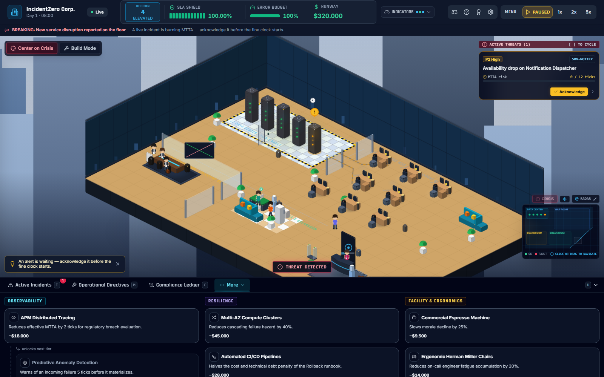
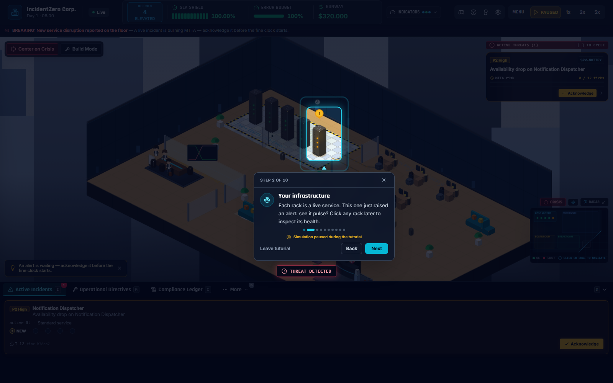

# INCIDENTZERO: SRE & IT GOVERNANCE SIMULATOR


[](https://github.com/christiansousadev/simulator-crisis/actions/workflows/ci.yml)
[](./LICENSE)
[](./frontend)
[](./backend)

**Language:** 🇺🇸 **English** (default) · [🇧🇷 Português](./README.pt-BR.md)

> **"Silence the alarms. Defend the SLA. Survive the audit."**

IncidentZero is a real-time tactical operations and systems reliability strategy game. As Head of Infrastructure / VP of Engineering, balance high availability, latency, cascading microservice outages, runbook mitigations, technical debt accumulation, on-call staffing, and compliance audits under live operational fire — all rendered as a living isometric office.

The core gameplay loop mirrors production incident lifecycle:
**Incident Trigger → Detection → Acknowledgment (MTTA) → Investigation (Log Triage) → Root-Cause Diagnosis → Mitigation (Runbooks) → Operational Consequences → Resolution (MTTR) → Post-Mortem Dossier → Compliance Audit → Career Progression**.

---

## Screenshots


<table>
<tr>
<td width="33%"></td>
<td width="33%"></td>
<td width="33%"></td>
</tr>
<tr>
<td align="center"><sub>Incident Detail (Tri-Block)</sub></td>
<td align="center"><sub>Runbook Mitigations</sub></td>
<td align="center"><sub>CRT Log Triage</sub></td>
</tr>
<tr>
<td width="33%"></td>
<td width="33%"></td>
<td width="33%"></td>
</tr>
<tr>
<td align="center"><sub>Active Incident on Floor</sub></td>
<td align="center"><sub>Tech Tree Upgrades</sub></td>
<td align="center"><sub>Interactive Tutorial</sub></td>
</tr>
</table>

---

## Core Features & Mechanics

### 1. Operations & Cascade Simulation
- **Interdependent Microservices:** Core 5-microservice dependency graph with dynamic infrastructure nodes, where upstream service degradation cascades to downstream dependencies based on latency and failure thresholds.
- **Incident Lifecycle (P1 and P2):** Critical-tier services raise P1 incidents and standard-tier services raise P2. Severity drives incident surcharges, MTTA penalties, and customer satisfaction / team morale (`user_happiness`) erosion.
- **Root-Cause Investigation:** Root causes remain masked under operational fog-of-war until an operator conducts log triage or assigns engineering investigation.
- **Interactive Log Triage:** Retro CRT terminal drawer streaming timestamped logs with ERROR/WARN/INFO filters; selecting actionable log evidence confirms the root cause and unlocks high-confidence mitigations.
- **Context-Aware Runbooks:** Mitigations feature execution costs, deterministic mitigation effectiveness based on cause compatibility (`formulas.MITIGATION_EFFECTIVENESS` with a 0.70 threshold for full resolution), technical debt index (TDI) deltas, cooldown periods, and operational restrictions.

### 2. SRE Metrics & Governance
- **Rolling Window SLA:** Evaluated continuously over a sliding window of up to 720 samples (1 sample per in-game hour/tick). Targets a 99.90% SLO benchmark (`SLA_BENCHMARK`); dropping below the 99.00% regulatory breach threshold (`SLA_BREACH_THRESHOLD`) after the 24-tick grace period (`BREACH_GRACE_TICKS`) triggers an official regulatory sanction (`SLA_BREACH_EMERGENCY_SANCTION`), flagging non-compliance without immediately ending the run.
- **Error Budget & Feature Freeze:** Derived from the 99.90% SLO (total error budget of 0.10%). When the error budget is depleted (0%), an automated feature freeze engages, temporarily restricting operations to remediation runbooks until availability recovers.
- **Cash Runway & Bankruptcy:** Operational overhead (server compute, cloud bills, engineering salaries, and audit fines) drains cash reserves. Reaching zero cash ($0.00) triggers terminal financial liquidation (`BANKRUPTCY_LIQUIDATION`), ending the run immediately.
- **Technical Debt Index (TDI):** Hasty patches and emergency workarounds increase TDI, applying an ongoing interest penalty to MTTR and increasing future incident hazard rates.
- **Board Reputation & CAB Dilemmas:** Periodic Change Advisory Board trade-offs (budget vs. tech debt vs. morale vs. reputation) with persistent board standings that modulate incident frequencies.

### 3. Staffing & On-Call Management
- **Engineer Hiring:** Recruit engineers across 4 core competencies matching service specializations: Authentication (`auth`), Payments (`payments`), API Gateway & Messaging (`gateway`), and Databases (`db`).
- **On-Call Rotations & Fatigue:** Balance active shifts and rest cycles; sustained incident handling depletes stamina and elevates stress, causing operational mistakes and slower MTTR.

### 4. Infrastructure & Tech Tree Upgrades
- **Tech Tree Upgrades:** Six one-time purchases across three branches:
  - *Observability:* APM Distributed Tracing, Predictive Anomaly Detection (5-tick advance warning).
  - *Resilience:* Multi-AZ Compute Clusters, Automated CI/CD Pipelines.
  - *Facilities:* Commercial Espresso Machine (slower morale decline), Ergonomic Chairs (slower on-call fatigue).
- **Build Mode:** Place Redis caches, Kafka queues, database read replicas, and NGINX load balancers against a service directly on the server-room shelves; each node reshapes that service's hazard or latency profile.

### 5. Scripted Scenarios & Game Modes
- **Sandbox Mode:** Unconstrained freeform simulation with customizable difficulty presets (Intern / Standard / Chaos).
- **Black Friday Rush:** Extreme consumer traffic spikes under tight SLA constraints; only capacity runbooks are allowed against overload.
- **Chaos Engineering Drill:** Random automated failure injections; win by finishing with zero regulatory breach flags.
- **Ransomware Infiltration:** Lateral movement from a compromised edge service; quarantine infected nodes before the master database falls.
- **DDoS Global Attack:** Multi-wave traffic flood; keep the API gateway above 80% uptime and payment incidents short.
- **Deployment Rollback Emergency:** A defective canary leaks memory on two services; triage both and restore them before time runs out.
- **Third-Party Provider Outage:** Payment and notification providers go dark and cannot be fixed internally; limit the blast radius until they recover.
- **Custom Chaos Scenarios:** Built-in scenario loader and editor supporting validated JSON configurations for custom hazard rates, failure rules, and scripted chaos events.

### 6. Post-Incident Dossier, Audit & AI Auditor
- **Unified Incident Dossier:** Comprehensive incident record aggregating forensic timelines, MTTA/MTTR metrics, financial damage, and remediation actions.
- **Compliance-Oriented Post-Mortems:** Generates structured post-mortems aligned with SOX-404 and SOC 2 style governance controls in Markdown and executive branded PDF formats, protected by SHA-256 **content checksums** for audit trail integrity verification.
- **AI Auditor Defense Interview:** Interactive post-incident compliance defense session where an AI compliance auditor interrogates the operator about response delays, runbook choices, and preventative measures. All financial penalties or waivers proposed by the AI are verified and enforced by the server backend with strict idempotency.

### 7. Career Progression & Replayability
- **Persistent Career Records:** Detailed historical records (`CareerRecord`) storing scenario outcomes, difficulty, SLA performance, days survived, and prestige points in SQLite.
- **Hall of Fame:** Permanent local career dashboard tracking personal bests, historical runs, and performance statistics across playthroughs.
- **Achievements & Operational Ranks:** 12 unlockable achievements and 5 tiered Operational Ranks earned through governance excellence.
- **Cosmetics & Dynamic Challenges:** Unlockable isometric office aesthetics and automated next-challenge recommendations derived from player progression, completed scenarios, difficulty history, and pending achievements.

---

## Tactical War Room & Game Feel

- **Living Isometric Office:** SVG isometric diorama with a spring-damped camera (zoom toward the cursor, drag with inertia, arrow/`+`/`-`/`Home` keys), a "Center on Crisis" flight to the worst failing rack, and a minimap with a draggable viewport frame.
- **Continuous Light:** Sky and office lighting follow the game hour smoothly, and DEFCON drives the mood: an amber pool at DEFCON 4, slow amber beacons at 3, and a staged red alert (flicker, beacons, sweep) at 2 or worse.
- **Racks That React:** Healthy, degraded and down racks change tint, LED pattern and effects with staged transitions, a one-shot failure shake, and a recovery sequence (scan bar, LEDs turning green, a "RESTORED" chip).
- **A Real Team on the Floor:** Desks stay vacant until you hire. New engineers walk in from reception to their desk, run to the server room when their service has an incident, and head to the lounge when resting.
- **Readable HUD:** Numbers count smoothly toward their new value, spends fly off the cash counter as labelled chips ("-$1,800 · Rollback"), the passive burn shows as a calm trend, meters flash when they cross a band, and runbook cooldowns sweep smoothly and flash when ready.
- **Lists With Memory:** Incidents sort by urgency and carry a New → Acknowledged → Investigated → Mitigating → Resolved track with the next action always visible; new ledger rows highlight; resolved cards stamp before they collapse.
- **Interactive Tutorial:** A coach-mark tour that spotlights the real rack, card, buttons and runbooks, waits for you to act, and spawns a guaranteed practice incident. Replay it any time from the help button or the pause menu.
- **Menus With Motion:** A living title screen over the running office, wipe transitions between screens, a staged post-match debrief (stamp, counting metrics, grade, objectives, prestige), a timed CAB decision with a draining deadline bar and outcome card, and a log-triage terminal with keyboard selection.
- **Procedural Audio:** One shared Web Audio graph with separate effects, UI and music buses, a calm menu theme that crossfades into a tension-aware in-game bed, muffled music while paused, and UI sounds for hover, confirm, stamp, gavel and more. Alarms only sound while the game is running.
- **Accessibility:** A Motion setting (system, reduced, full) that turns decorative animation into static states without hiding any message, high-contrast and colorblind-safe modes, dialogs with focus traps and an Escape stack, live regions for toasts, and keyboard-reachable lists.

### Keyboard Shortcuts

| Key | Action |
|---|---|
| `Space` | Pause or resume |
| `1` `2` `5` | Game speed |
| `I` `M` `C` `U` `R` `A` `G` | Dock tabs: incidents, directives, compliance, upgrades, roster, achievements, metrics |
| `[` `]` | Previous or next open incident |
| `B` | Build mode |
| Arrows, `+` `-`, `Home` | Pan, zoom and reset the camera |
| `Esc` | Close the top-most dialog, or open the pause menu |

Shortcuts stay quiet while a dialog is open.

---

## Server-Authoritative Architecture & Resilience

IncidentZero enforces a **Server-Authoritative Architecture**:
- The backend FastAPI simulation engine is the single source of truth for all mathematical models, SLA rolling calculations, financial ledger balances, incident lifecycle transitions, and scenario objective evaluations. The frontend operates as a responsive tactical client.
- **Session Resilience & Persistence:** Active game states are periodically persisted as atomic snapshots in SQLite. Server restarts or page reloads seamlessly restore the simulation without losing active incidents, investigation progress, purchased upgrades, cooldowns, RNG seed determinism, or the rolling SLA sample buffer.

---

## Architecture Overview

- **Frontend:** React 18, Vite, TypeScript, Tailwind CSS, Lucide Icons, Zustand state management, WebSocket client. Tested via Vitest and Playwright.
- **Backend:** Python 3.12, FastAPI, deterministic tick loop engine (1 tick = 1 virtual hour), SQLAlchemy, SQLite, Pydantic v2. Tested via pytest.
- **Database Migrations:** [Alembic](https://alembic.sqlalchemy.org/) manages schema versions and runs automatic migrations on startup (`alembic upgrade head`).
- **Telemetry Stream:** Bidirectional WebSocket (`/ws/telemetry`) streaming live tick deltas, rack states, metrics, and incident notifications.
- **Compliance Audit Ledger:** Append-only SQLite event log tracking 34 distinct governance and operational event types.
- **AI Integration (Optional):** The post-mortem auditor interview talks to any OpenAI-compatible chat-completions endpoint (`LLM_API_BASE_URL`, `LLM_API_KEY`, `LLM_MODEL_ID`). Without a key the interview route answers 503; there is no offline fallback.

See [ARCHITECTURE.md](./ARCHITECTURE.md) for complete technical blueprints, mathematical formulas, and database schemas.

---

## Quickstart

### Option A — One-Shot Start Scripts

```bash
# Windows PowerShell
.\start.ps1

# macOS / Linux / Git Bash
./start.sh
```

Both scripts verify prerequisites, set up the backend virtual environment, install Python and Node dependencies, and concurrently launch the FastAPI and Vite development servers. If port 8000 is busy the backend automatically moves to 8010 and the frontend is pointed at it; the scripts print the API and UI URLs on start (`./start.sh <backend_port> <frontend_port>` / `.\start.ps1 -Port <n> -FrontendPort <n>` choose ports explicitly).

### Option B — Docker Compose

```bash
docker compose up --build
```

The UI is served on `http://localhost:5173` and the API on `http://localhost:8000`. The SQLite save lives on the `backend-data` named volume (`/app/data/incidentzero.db`), so it survives `docker compose down` and container rebuilds (`docker compose down -v` wipes it). Post-mortem reports and interviews are written to the bind-mounted `./audits/` folder. The backend exposes a healthcheck on `/api/health` and the frontend container starts only once it is healthy.

### Option C — Manual Setup (Two Terminals)

**Backend Terminal**
```bash
cd backend
python -m venv .venv
.\.venv\Scripts\activate        # Windows
# source .venv/bin/activate     # Linux / macOS
pip install -r requirements.txt
uvicorn app.main:app --reload --port 8000
```
*Database migrations run automatically on startup via Alembic.*

**Frontend Terminal**
```bash
cd frontend
npm install
npm run dev
```

- Open `http://localhost:5173` to access the War Room.
- Interactive backend API documentation (Swagger UI) is available at `http://localhost:8000/docs`.
- Every state-changing REST command also pushes a fresh telemetry frame over the WebSocket, so the screen updates immediately even while the game is paused.

---

## Database Migrations

Schema evolution is fully automated via Alembic:
- On every backend boot, `app/main.py` executes `alembic upgrade head` before the simulation engine starts.
- When modifying SQLAlchemy models, generate a migration revision before restarting:
  ```bash
  cd backend
  alembic revision --autogenerate -m "describe schema change"
  ```
- If an existing database lacks an `alembic_version` table (legacy database pre-Alembic), the backend aborts with a clear prompt to remove the outdated database file.

---

## Testing & Quality Assurance

```bash
# Backend — from backend/ with active virtualenv
ruff check .                                        # Static linting
pytest tests/ -v                                     # Full unit & integration test suite
pytest tests/ --cov=app --cov-report=term-missing    # Test coverage analysis

# Frontend — from frontend/
npm run lint           # ESLint analysis
npx tsc --noEmit       # TypeScript type check
npm test               # Vitest unit test suite
npm run test:coverage  # Vitest test coverage
npm run build          # Production bundle build

# End-to-End Suite — from frontend/ with backend virtualenv available
npm run test:e2e       # Playwright E2E suite driving live servers and WebSocket

# Everything CI runs, in one command — from the repo root
make check             # lint + tsc + unit tests + build + e2e (also: make lint | test | build | e2e)
```

The Playwright test suite (`frontend/e2e/`) verifies real browser interactions against live backend and WebSocket instances without mocking. CI executes all linting, unit tests, type checks, and E2E suites on every pull request (`.github/workflows/ci.yml`).

---

## Key API Endpoints

The backend provides 35+ REST endpoints across 14 domain routers in addition to the live WebSocket stream. Explore the interactive documentation at `http://localhost:8000/docs`.

| Router | Base Path | Description |
|---|---|---|
| Sessions | `/api/session/*`, `/api/health` | Simulation lifecycle (start/pause/reset), speed control, state snapshots |
| Services | `/api/services` | Service mesh topology and health status |
| Incidents | `/api/incidents/*` | Incident streams, acknowledgment, investigation, log triage |
| Mitigations | `/api/mitigations/*` | Runbook mitigation catalog and execution |
| Audits | `/api/audits/*` | Compliance audit ledger, Markdown/PDF post-mortems, AI defense interview |
| Upgrades | `/api/upgrades/*` | Tech tree upgrades across Observability, Resilience, and Facilities |
| Dilemmas | `/api/dilemmas/*` | Change Advisory Board (CAB) dilemma options and resolution |
| Staff | `/api/staff/*` | Engineer hiring, competency management, shift rotations |
| Scenarios | `/api/scenarios/*` | Scripted scenario catalog, active scenario state, custom scenario builder |
| Infrastructure | `/api/infrastructure/*` | Build-mode node catalog, rack placement, and removals |
| Achievements | `/api/achievements/*` | Achievement catalog, unlock evaluations |
| Cosmetics | `/api/cosmetics/*` | Office cosmetic catalog and prestige-point purchases |
| Career | `/api/career/*` | Hall of Fame records, career summary, personal bests, next challenges |
| Tutorial | `/api/tutorial/incident` | Spawns a deterministic practice incident for the interactive tutorial |
| Telemetry | `/ws/telemetry` | Real-time WebSocket stream for simulation ticks and telemetry |

---

## Technical Documentation & Reference

For comprehensive technical specifications and architecture blueprints, refer to:
- [ARCHITECTURE.md](./ARCHITECTURE.md) — System architecture, mathematical models, and database schema.
- [`audits/docs/01_SYSTEM_ARCHITECTURE_AND_DATA_FLOW.md`](./audits/docs/01_SYSTEM_ARCHITECTURE_AND_DATA_FLOW.md) — Core engine data flows and WebSocket protocol.
- [`audits/docs/02_MATHEMATICAL_ENGINE_AND_SLA_SPECIFICATION.md`](./audits/docs/02_MATHEMATICAL_ENGINE_AND_SLA_SPECIFICATION.md) — Rolling SLA window, MTTA/MTTR, and financial formulas.
- [`audits/docs/03_GOVERNANCE_AND_COMPLIANCE_CONTROLS.md`](./audits/docs/03_GOVERNANCE_AND_COMPLIANCE_CONTROLS.md) — Audit logging, SOX-404 / SOC2 controls, and AI interview safety.
- [`audits/docs/04_RUNBOOK_CATALOG_AND_MITIGATION_MATRIX.md`](./audits/docs/04_RUNBOOK_CATALOG_AND_MITIGATION_MATRIX.md) — SRE runbook mitigation catalog and effect matrix.
- [`audits/docs/05_POST_MORTEM_STANDARD_OPERATING_PROCEDURE.md`](./audits/docs/05_POST_MORTEM_STANDARD_OPERATING_PROCEDURE.md) — Post-mortem generation SOP, dossiers, and PDF checksums.
- [`audits/docs/implementations/10_UX_INTERACTION_AND_MOTION_LAYER_SPEC.md`](./audits/docs/implementations/10_UX_INTERACTION_AND_MOTION_LAYER_SPEC.md) — UX interaction and motion layer: tokens, reduced motion, dialog/focus rules, HUD, tutorial, audio, i18n loading, test contracts, known limitations.

---

## Project Structure

```
simulator-crisis/
├── backend/            FastAPI server: engine, models, schemas, api/v1 routers, alembic migrations, tests
├── frontend/           React + Vite + TypeScript dashboard, i18n (en/pt-BR/es), Vitest and Playwright e2e suites
├── audits/             Post-mortem templates, generated reports, and detailed technical specifications (audits/docs/)
├── docs/screenshots/   Official war-room screenshots
├── .github/            CI/CD GitHub Actions workflows, Dependabot, and issue templates
├── LICENSE             MIT License
├── SECURITY.md         Security policy and vulnerability reporting
├── CHANGELOG.md        Version history and feature release notes
├── ARCHITECTURE.md     Complete system blueprint and design specification
└── README.md           Project overview (English) / README.pt-BR.md (Português)
```

---

## Current Known Limitations

- **Single-Operator Context:** Designed as an immersive single-player workstation simulation; there is currently no multi-tenant authentication or remote user role segregation.
- **Local Persistence Scope:** Career records, achievements, and the Hall of Fame are stored locally within the instance's SQLite database.
- **Snapshot Versioning:** Corrupted or structurally incompatible session snapshots from older schema versions are quarantined automatically rather than presenting an interactive repair UI.

---

## Contributing

Contributions and issue reports are welcome via [GitHub Issues](https://github.com/christiansousadev/simulator-crisis/issues). Before submitting a pull request, ensure all tests, linting, and type checks pass locally using the commands listed in [Testing & Quality Assurance](#testing--quality-assurance).

## Security

Please review [SECURITY.md](./SECURITY.md) for details on the security posture, accepted threat model, and how to report vulnerabilities.

## License

[MIT](./LICENSE) © Christian Sousa
