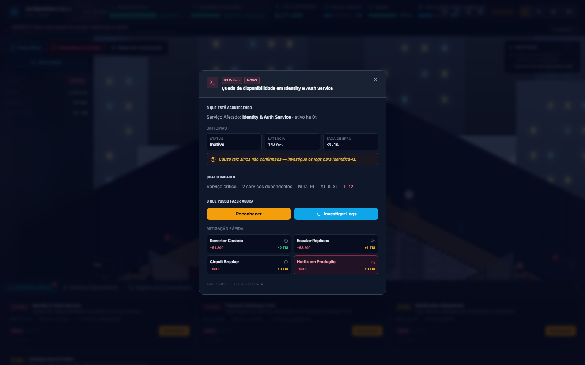
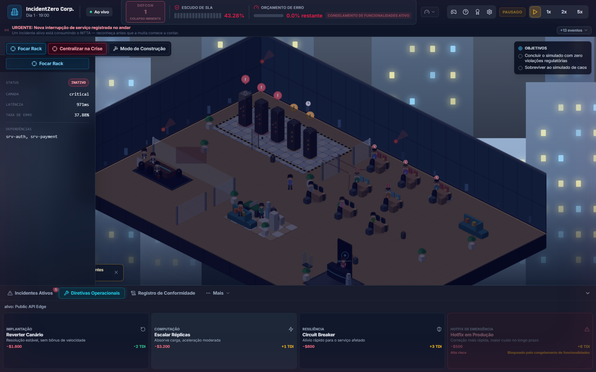
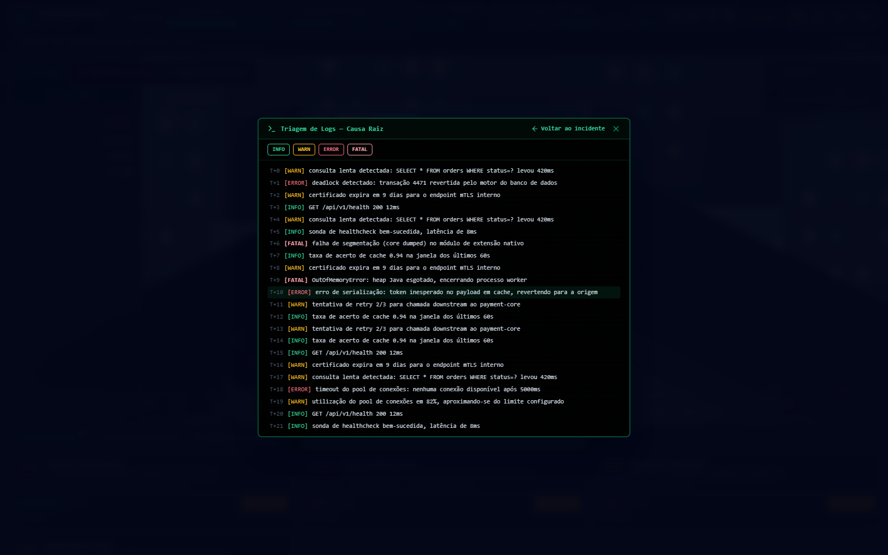
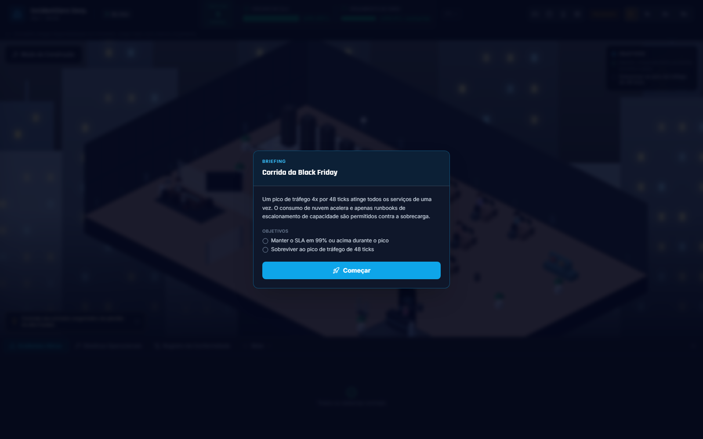
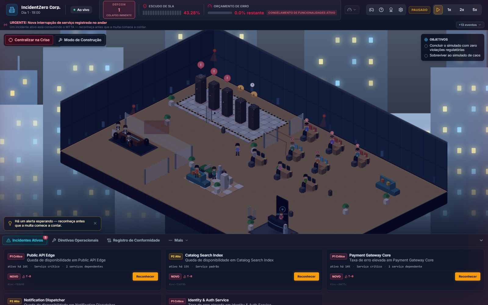
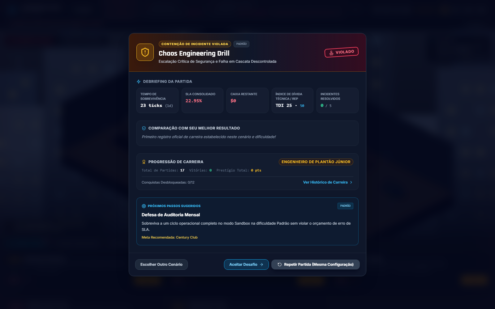

# INCIDENTZERO: SIMULADOR DE SRE E GOVERNANÇA DE TI


[](https://github.com/christiansousadev/simulator-crisis/actions/workflows/ci.yml)
[](./LICENSE)
[](./frontend)
[](./backend)

**Idioma:** [🇺🇸 English](./README.md) (padrão) · 🇧🇷 **Português** (você está aqui)

> **"Silencie os alarmes. Defenda o SLA. Sobreviva à auditoria."**

IncidentZero é um jogo de estratégia e gestão tática de operações e confiabilidade de sistemas em tempo real. No papel de Head of Infrastructure / VP of Engineering, equilibre alta disponibilidade, latência, falhas em cascata de microsserviços, mitigações de runbook, acúmulo de dívida técnica, alocação de equipe em plantão e auditorias de conformidade sob fogo operacional ao vivo — tudo renderizado como um escritório isométrico dinâmico.

O loop principal de gameplay reflete o ciclo de vida real de resposta a incidentes:
**Disparo do Incidente → Detecção → Reconhecimento (MTTA) → Investigação (Log Triage) → Diagnóstico de Causa Raiz → Mitigação (Runbooks) → Consequências Operacionais → Resolução (MTTR) → Dossiê de Pós-Incidente → Auditoria de Compliance → Progressão de Carreira**.

---

## Capturas de Tela


<table>
<tr>
<td width="33%"></td>
<td width="33%"></td>
<td width="33%"></td>
</tr>
<tr>
<td align="center"><sub>Detalhe do Incidente (Tri-Bloco)</sub></td>
<td align="center"><sub>Diretivas de Mitigação</sub></td>
<td align="center"><sub>Terminal CRT de Log Triage</sub></td>
</tr>
<tr>
<td width="33%"></td>
<td width="33%"></td>
<td width="33%"></td>
</tr>
<tr>
<td align="center"><sub>Briefing de Cenário</sub></td>
<td align="center"><sub>Crise Crítica (DEFCON 1)</sub></td>
<td align="center"><sub>Debrief Pós-Partida</sub></td>
</tr>
</table>

---

## Funcionalidades e Mecânicas Principais

### 1. Operação e Simulação de Falhas em Cascata
- **Microsserviços Interdependentes:** Grafo de dependências central de 5 microsserviços com nós de infraestrutura dinâmicos, onde a degradação de serviços upstream propaga latência e falhas para componentes dependentes.
- **Ciclo de Vida de Incidentes (P1 a P4):** Severidades geram penalidades crescentes de MTTA/MTTR, sobretaxas financeiras e erosão na satisfação do usuário (moral / user happiness).
- **Investigação com Causa Raiz Oculta:** A causa raiz do problema permanece sob sigilo (névoa operacional) até que a equipe realize a triagem de logs ou aloque engenheiros para investigação.
- **Log Triage Interativo:** Gaveta retrô de terminal CRT com streaming de logs contendo timestamps e filtros por nível (ERROR, WARN, INFO); selecionar uma linha com evidência concreta confirma a causa raiz e libera mitigações de alta eficácia.
- **Catálogo de Runbooks Contextuais:** Ações de mitigação com custo financeiro, eficácia determinística baseada na compatibilidade com a causa raiz (`formulas.MITIGATION_EFFECTIVENESS` com limiar de 0.70 para resolução completa), variação de Dívida Técnica (TDI), tempo de cooldown e restrições operacionais.

### 2. Métricas de SRE e Governança
- **Janela Móvel de SLA:** Calculada continuamente sobre uma janela deslizante de até 720 amostras (1 amostra por hora/tick no jogo). Adota meta de benchmark de 99.90% (`SLA_BENCHMARK`); cair abaixo do limiar regulatório de 99.00% (`SLA_BREACH_THRESHOLD`) após o período de carência de 24 ticks (`BREACH_GRACE_TICKS`) acarreta uma sanção regulatória emergencial (`SLA_BREACH_EMERGENCY_SANCTION`), emitindo alerta de não-conformidade sem encerrar a sessão imediatamente.
- **Error Budget e Congelamento de Features:** Derivado do benchmark de 99.90% (orçamento total de erro de 0.10%). O congelamento de deploys é acionado automaticamente quando o error budget zera, bloqueando temporariamente entregas arriscadas e restringindo as operações a runbooks de remediação até que a disponibilidade se recupere.
- **Caixa Operacional e Falência:** Custos operacionais contínuos (servidores em nuvem, salários e multas de conformidade) consomem o saldo financeiro. Atingir saldo zero ($0,00) acarreta liquidação por falência (`BANKRUPTCY_LIQUIDATION`), encerrando a partida de forma definitiva.
- **Índice de Dívida Técnica (TDI):** Soluções improvisadas aumentam o TDI, impondo juros operacionais que elevam o MTTR e amplificam o risco de incidentes futuros.
- **Reputação com o Conselho e Dilemas do CAB:** Votações periódicas do Change Advisory Board (orçamento vs. dívida técnica vs. moral vs. reputação) com impactos duradouros na confiança corporativa.

### 3. Gestão de Equipe e Plantão (On-Call)
- **Contratação de Engenheiros:** Recrute profissionais em 4 competências essenciais correspondentes às especializações dos serviços: Autenticação (`auth`), Pagamentos (`payments`), API Gateway & Mensageria (`gateway`) e Bancos de Dados (`db`).
- **Rotação de Turnos e Fadiga:** Alterne turnos de plantão; incidentes contínuos consomem energia (stamina) e elevam o estresse, aumentando a chance de erros operacionais e lentidão de resposta.

### 4. Infraestrutura e Árvore Tecnológica
- **Upgrades da Tech Tree:** Desbloqueie melhorias divididas em três ramos:
  - *Observabilidade:* Rastreamento Distribuído (APM), Detecção Preditiva de Anomalias, Real User Monitoring (RUM).
  - *Resiliência:* Failover Multi-AZ, Clusters com Auto-Scaling, Circuit Breakers, Automação de Caos.
  - *Instalações:* Geradores de Backup, Estações Ergonômicas, Máquinas de Café (recuperação de moral).
- **Modo Construção:** Posicionamento modular de nós e expansão de racks diretamente no chão do datacenter.

### 5. Cenários Roteirizados e Modos de Jogo
- **Modo Sandbox:** Simulação livre com configurações ajustáveis de dificuldade (Estagiário, Padrão, Caos Total).
- **Black Friday Rush:** Pico extremo de tráfego de usuários e saturação de conexões de banco de dados sob rigorosos requisitos de SLA.
- **Chaos Engineering Drill:** Injeções programadas de falhas automatizadas testando a resiliência arquitetural e failovers.
- **Infiltração de Ransomware:** Crise de segurança exigindo isolamento de tráfego lateral suspeito, análise forense de logs e restauração limpa de snapshots.
- **Cenários Customizados:** Editor e carregador integrado de cenários com validação estrita de schema JSON para definição de multiplicadores de risco, regras de falha e eventos roteirizados.

### 6. Dossiê de Pós-Incidente, Auditoria e Auditor IA
- **Dossiê Unificado de Incidente:** Registro estruturado consolidando a linha do tempo forense, métricas de MTTA/MTTR, impacto financeiro e mitigações adotadas.
- **Post-Mortems Estruturados para Conformidade:** Geração de relatórios técnicos em Markdown e relatórios executivos em PDF alinhados com controles de governança no estilo SOX-404 e SOC 2, validados por um **checksum de conteúdo** (hash SHA-256 para integridade de trilha de auditoria).
- **Entrevista de Auditoria com IA:** Sessão interativa de defesa pós-incidente na qual um auditor virtual interroga o operador sobre decisões tomadas, demoras e medidas preventivas. Todas as propostas de multas ou isenções geradas pela IA são validadas e aplicadas pelo servidor backend sob estrita idempotência.

### 7. Carreira e Replayability
- **Registros Permanentes de Carreira:** Armazenamento persistente (`CareerRecord`) no banco SQLite contendo resultados de partidas, dificuldade, SLA mantido, dias sobrevividos e prestígio acumulado.
- **Hall da Fama:** Painel local de carreira rastreando recordes pessoais, histórico detalhado de runs e estatísticas consolidadas.
- **Conquistas e Postos Operacionais:** 12 conquistas desbloqueáveis e 5 Postos Operacionais (Ranks) conquistados por excelência em governança.
- **Cosméticos e Recomendação de Desafio:** Personalização visual do escritório e recomendação dinâmica do próximo desafio derivada do progresso da carreira, cenários concluídos, histórico de dificuldade e conquistas pendentes.

---

## War Room Tático e Game Feel

- **Escritório Isométrico Dinâmico:** Visualização vetorial/canvas isométrica com zoom, pan suave e foco contextual/sob comando (botões "Focar Rack" e "Centralizar na Crise", além de click-to-focus no rack de servidores sob alerta).
- **Estados Visuais dos Racks:** Racks com iluminação dinâmica refletindo seu estado (saudável, degradado, down, investigando, mitigando), telemetria em LED e sinalizador visual de alarme pulsante.
- **Feedback de Crise e Severidade:** Níveis DEFCON (1 a 5) acionam variações na iluminação ambiente, vinheta de emergência pulsante e breaking news no ticker corporativo.
- **HUD Tático:** Medidores animados de SLA, Error Budget, Caixa, Dívida Técnica e Moral, complementados por texto flutuante de combate exibindo impactos de MTTR e custos.
- **Fluxo de Modais Integrado:** Briefing de Cenário, Detalhe Tri-Bloco do Incidente, Terminal CRT de Logs, Banner de Resolução de Incidente e Debrief de Pós-Partida.
- **Áudio Procedural e Acessibilidade:** Sintetizador sonoro via Web Audio API gerando timbres característicos para alarmes DEFCON, execução de runbooks, cliques de interface e ruído de servidores, com suporte a `prefers-reduced-motion` e paleta segura para daltonismo.

---

## Autoridade do Servidor e Persistência

O IncidentZero adota **Arquitetura Autoritativa no Servidor**:
- O motor de simulação em FastAPI é a única fonte de verdade para todos os cálculos matemáticos, avaliação de janela de SLA, saldo financeiro, ciclo de vida dos incidentes e objetivos de cenário. O frontend atua como um terminal tático reativo.
- **Resiliência e Persistência de Sessão:** O estado da simulação é salvo periodicamente como snapshot atômico em SQLite. Reinicializações do backend ou recarregamentos do navegador restauram a partida em andamento sem perda de incidentes ativos, progresso de investigação, upgrades comprados, cooldowns, semente de RNG ou histórico da janela de SLA.

---

## Visão Geral da Arquitetura

- **Frontend:** React 18, Vite, TypeScript, Tailwind CSS, Lucide Icons, gerenciamento de estado Zustand, cliente WebSocket. Testado com Vitest e Playwright.
- **Backend:** Python 3.12, FastAPI, motor de ticks determinístico (1 tick = 1 hora no jogo), SQLAlchemy, SQLite, Pydantic v2. Testado com pytest.
- **Migrações de Banco de Dados:** O [Alembic](https://alembic.sqlalchemy.org/) controla o versionamento do schema e aplica migrações automaticamente na inicialização (`alembic upgrade head`).
- **Stream de Telemetria:** Canal bidirecional WebSocket (`/ws/telemetry`) transmitindo deltas de tick, estados dos racks, métricas operacionais e alertas.
- **Ledger de Compliance:** Log imutável de auditoria persistido no SQLite rastreando 29 tipos distintos de eventos operacionais e de governança.
- **Integração com IA (Opcional):** Módulo desacoplado de auditoria de conformidade compatível com OpenAI, Anthropic ou fallback determinístico offline.

Consulte o [ARCHITECTURE.md](./ARCHITECTURE.md) (em inglês) para diagramas técnicos completos, fórmulas matemáticas e schemas do banco de dados.

---

## Início Rápido

### Opção A — Scripts de Inicialização Automática

```bash
# Windows PowerShell
.\start.ps1

# macOS / Linux / Git Bash
./start.sh
```

Ambos os scripts verificam os pré-requisitos, criam o ambiente virtual do backend, instalam as dependências de Python e Node e iniciam simultaneamente os servidores de desenvolvimento do FastAPI e do Vite.

### Opção B — Docker Compose

```bash
docker compose up --build
```

### Opção C — Manual (Dois Terminais)

**Terminal do Backend**
```bash
cd backend
python -m venv .venv
.\.venv\Scripts\activate        # Windows
# source .venv/bin/activate     # Linux / macOS
pip install -r requirements.txt
uvicorn app.main:app --reload --port 8000
```
*As migrações de banco de dados rodam automaticamente na inicialização pelo Alembic.*

**Terminal do Frontend**
```bash
cd frontend
npm install
npm run dev
```

- Acesse `http://localhost:5173` para entrar na War Room.
- A documentação interativa da API do backend (Swagger UI) fica disponível em `http://localhost:8000/docs`.

---

## Migrações de Banco de Dados

A evolução do banco de dados é automatizada via Alembic:
- A cada inicialização do backend, `app/main.py` executa `alembic upgrade head` antes de iniciar o motor de simulação.
- Caso modifique um modelo SQLAlchemy, crie uma nova revisão de migração antes de reiniciar:
  ```bash
  cd backend
  alembic revision --autogenerate -m "descreva a alteração de schema"
  ```
- Se o banco de dados for anterior à introdução do Alembic (sem tabela `alembic_version`), o backend aborta a inicialização solicitando a remoção do arquivo de banco legado.

---

## Testes e Controle de Qualidade

```bash
# Backend — a partir de backend/ com ambiente virtual ativo
ruff check .                                        # Análise estática e linting
pytest tests/ -v                                     # Suíte de testes unitários e de integração
pytest tests/ --cov=app --cov-report=term-missing    # Análise de cobertura de testes

# Frontend — a partir de frontend/
npm run lint           # Análise estática com ESLint
npx tsc --noEmit       # Verificação de tipos TypeScript
npm test               # Suíte de testes unitários com Vitest
npm run test:coverage  # Cobertura de testes unitários
npm run build          # Build do pacote de produção

# Suíte End-to-End — a partir de frontend/ com o backend acessível
npm run test:e2e       # Suíte Playwright E2E contra servidores reais e WebSocket
```

A suíte Playwright (`frontend/e2e/`) valida os fluxos reais da interface contra instâncias ativas do backend e WebSocket sem uso de mocks. O pipeline de CI valida linting, testes unitários, checagem de tipos e testes end-to-end a cada pull request (`.github/workflows/ci.yml`).

---

## Principais Endpoints da API

O backend disponibiliza mais de 30 endpoints REST em 13 roteadores de domínio, além do canal WebSocket. A documentação interativa pode ser explorada em `http://localhost:8000/docs`.

| Roteador | Caminho Base | Descrição |
|---|---|---|
| Sessões | `/api/session/*`, `/api/health` | Ciclo de vida da simulação (iniciar/pausar/resetar), velocidade e snapshots de estado |
| Serviços | `/api/services` | Topologia da malha de microsserviços e métricas de integridade |
| Incidentes | `/api/incidents/*` | Stream de incidentes ativos, reconhecimento, investigação e log triage |
| Mitigações | `/api/mitigations/*` | Catálogo e execução de runbooks de remediação |
| Auditorias | `/api/audits/*` | Ledger de compliance, post-mortems em Markdown/PDF e entrevista com auditor IA |
| Upgrades | `/api/upgrades/*` | Melhorias da tech tree em Observabilidade, Resiliência e Instalações |
| Dilemmas | `/api/dilemmas/*` | Propostas e resolução de dilemas do Change Advisory Board (CAB) |
| Equipe | `/api/staff/*` | Contratação de engenheiros, competências e rotação de turnos |
| Cenários | `/api/scenarios/*` | Catálogo de cenários roteirizados, estado ativo e criador de cenários customizados |
| Infraestrutura | `/api/infrastructure/*` | Catálogo de nós no modo construção, posicionamento e remoção |
| Conquistas | `/api/achievements/*` | Catálogo e validação de conquistas operacionais |
| Cosméticos | `/api/cosmetics/*` | Catálogo de cosméticos visuais do escritório e compras por prestígio |
| Carreira | `/api/career/*` | Hall da Fama, resumo de carreira, recordes pessoais e recomendação de desafio |
| Telemetria | `/ws/telemetry` | Canal WebSocket em tempo real para transmissão de ticks e telemetria |

---

## Documentação Técnica de Referência

Para especificações detalhadas de engenharia e blueprints de arquitetura, consulte:
- [ARCHITECTURE.md](./ARCHITECTURE.md) (em inglês) — Arquitetura de sistemas, fórmulas matemáticas e modelos de dados.
- [`audits/docs/01_SYSTEM_ARCHITECTURE_AND_DATA_FLOW.md`](./audits/docs/01_SYSTEM_ARCHITECTURE_AND_DATA_FLOW.md) — Fluxo de dados e protocolo WebSocket do motor.
- [`audits/docs/02_MATHEMATICAL_ENGINE_AND_SLA_SPECIFICATION.md`](./audits/docs/02_MATHEMATICAL_ENGINE_AND_SLA_SPECIFICATION.md) — Janela móvel de SLA, fórmulas de MTTA/MTTR e economia.
- [`audits/docs/03_GOVERNANCE_AND_COMPLIANCE_CONTROLS.md`](./audits/docs/03_GOVERNANCE_AND_COMPLIANCE_CONTROLS.md) — Auditoria, conformidade SOX-404 / SOC2 e segurança do auditor IA.
- [`audits/docs/04_RUNBOOK_CATALOG_AND_MITIGATION_MATRIX.md`](./audits/docs/04_RUNBOOK_CATALOG_AND_MITIGATION_MATRIX.md) — Catálogo de runbooks e matriz de efeitos de mitigação.
- [`audits/docs/05_POST_MORTEM_STANDARD_OPERATING_PROCEDURE.md`](./audits/docs/05_POST_MORTEM_STANDARD_OPERATING_PROCEDURE.md) — Procedimento padrão de post-mortem, dossiês e checksums em PDF.

---

## Estrutura do Repositório

```
simulator-crisis/
├── backend/            Servidor FastAPI: motor, modelos, schemas, roteadores api/v1, migrações alembic e testes
├── frontend/           Dashboard em React + Vite + TypeScript, i18n (en/pt-BR/es), testes Vitest e Playwright e2e
├── audits/             Templates de post-mortem, relatórios gerados e especificações técnicas (audits/docs/)
├── docs/screenshots/   Capturas de tela oficiais da war room
├── .github/            Workflows do GitHub Actions para CI/CD, Dependabot e templates de issue
├── LICENSE             Licença MIT
├── SECURITY.md         Política de segurança e relato de vulnerabilidades
├── CHANGELOG.md        Histórico de versões e notas de lançamento
├── ARCHITECTURE.md     Blueprint completo do sistema e especificações técnicas
└── README.md           Apresentação geral (Inglês) / README.pt-BR.md (Português)
```

---

## Limitações Conhecidas

- **Contexto de Operador Único:** Projetado como uma simulação de estação de trabalho single-player; não possui controle multi-tenant de usuários ou autenticação remota.
- **Escopo Local de Persistência:** Os registros de carreira, conquistas e o Hall da Fama são armazenados localmente na instância do banco SQLite.
- **Tratamento de Snapshots Incompatíveis:** Snapshots de sessões corrompidos ou estruturalmente incompatíveis de versões antigas são movidos automaticamente para quarentena sem interface de reparo manual.

---

## Contribuindo

Relatos de problemas e sugestões são bem-vindos através de [GitHub Issues](https://github.com/christiansousadev/simulator-crisis/issues). Antes de submeter um pull request, assegure-se de que todos os testes, linter e checagem de tipos passem localmente conforme descrito na seção [Testes e Controle de Qualidade](#testes-e-controle-de-qualidade).

## Segurança

Consulte [SECURITY.md](./SECURITY.md) para detalhes sobre a postura de segurança, modelo de ameaças e como reportar vulnerabilidades.

## Licença

[MIT](./LICENSE) © Christian Sousa
