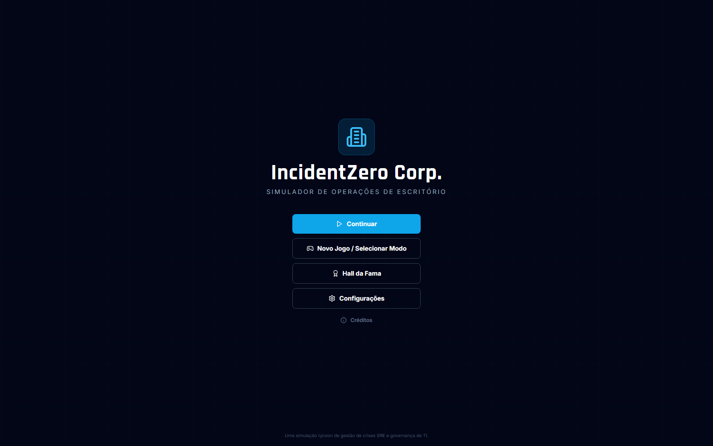
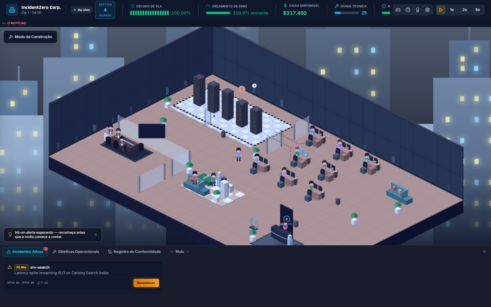

# INCIDENTZERO: SIMULADOR DE SRE E GOVERNANÇA DE TI


[](https://github.com/christiansousadev/simulator-crisis/actions/workflows/ci.yml)
[](./LICENSE)
[](./frontend)
[](./backend)

**Idioma:** [🇺🇸 English](./README.md) (padrão) · 🇧🇷 **Português** (você está aqui)

> **"Silencie os alarmes. Defenda o SLA. Sobreviva à auditoria."**

IncidentZero é um jogo de simulação de crise e engenharia de sistemas em tempo real. Como Head of Infrastructure / VP of Engineering, equilibre alta disponibilidade, latência, falhas em cascata, mitigações de runbook, acúmulo de dívida técnica, contratação de equipe e auditorias de compliance sob fogo de plantão ao vivo — tudo renderizado como um escritório isométrico vivo.

---

## Capturas de Tela





Mais capturas de tela (em inglês) estão disponíveis no [README em inglês](./README.md#screenshots).

---

## Funcionalidades

- **Simulação de crise ao vivo** — um loop de ticks determinístico (1 tick = 1 hora no jogo) conduz falhas em cascata de serviços, mecânicas de MTTA/MTTR, orçamento de erro (error budget) e congelamentos de features, tudo transmitido via WebSocket para uma visão isométrica do escritório.
- **Runbooks e árvore tecnológica** — execute mitigações de SRE contra serviços com falha e compre upgrades de observabilidade/resiliência/instalações (APM tracing, detecção preditiva de anomalias, clusters multi-AZ e mais).
- **Equipe e plantão** — contrate engenheiros com uma competência principal, alterne turnos e gerencie estresse/energia sob carga sustentada de incidentes.
- **Governança e dilemas do CAB** — trade-offs periódicos do Change Advisory Board (orçamento vs. dívida técnica vs. moral vs. reputação) com consequências duradouras: uma pontuação persistente de **Reputação com o Conselho** altera a taxa de risco de incidentes e libera dilemas de "retorno" condicionados à reputação.
- **Níveis de dificuldade** — Estagiário / Padrão / Caos Total, cada um com seu próprio orçamento inicial e multiplicador de risco.
- **Ledger de compliance e post-mortems** — toda ação relevante para governança é registrada em um log de auditoria; conclua um incidente com um post-mortem em Markdown ou PDF de marca própria, com entrevista de um auditor de IA e **replay** acelerado dos eventos.
- **Cenários roteirizados e criador de cenários customizados** — Black Friday Rush, Infiltração de Ransomware, Simulação de Chaos Engineering, além de um editor de configuração sandbox para multiplicadores de risco, piso de orçamento e injeções de caos roteirizadas.
- **Conquistas, cosméticos e progressão de carreira** — um catálogo de 12 conquistas, desbloqueios cosméticos por pontos de prestígio, e um Hall da Fama permanente (ranking por jogador e global) que sobrevive a cada reinício de sessão.
- **Onboarding guiado** — um tutorial com spotlight que ilumina o elemento real da interface sendo explicado, além de um sistema de dicas contextuais de "o que fazer agora" para novos jogadores.
- **HUD e escritório polidos** — medidores animados e um contador de orçamento suavizado, estilo visual e transições de entrada consistentes em todos os modais, um ciclo dia/noite que agora também tinge o céu (não só o interior do escritório), e feedback de clique em todos os botões.
- **Configurações e acessibilidade** — volume de música/efeitos separado, modo de alto contraste, paleta segura para daltonismo e tradução completa da interface.
- **Internacionalização** — Inglês (padrão), Português (Brasil) e Espanhol, com paridade total entre todas as strings da interface.
- **PWA instalável** — o app inclui um web manifest e service worker; a casca do app instala e carrega offline, enquanto toda chamada de simulação sempre acessa o backend ao vivo (sem estado de jogo em cache desatualizado).

Veja [ARCHITECTURE.md](./ARCHITECTURE.md) (em inglês) para o blueprint técnico completo, fórmulas matemáticas e schemas SQL, e [`audits/docs/`](./audits/docs/) para uma especificação de implementação por funcionalidade de tudo acima.

---

## Visão Geral da Arquitetura

- **Frontend:** React 18, Vite, TypeScript, Tailwind CSS, Lucide Icons, store Zustand, cliente WebSocket. Testado com Vitest + Testing Library.
- **Backend:** Python FastAPI, transmissão de telemetria via WebSocket, SQLAlchemy / SQLite, Pydantic v2. Testado com pytest.
- **Migrações de banco de dados:** Alembic — o schema é versionado e atualizado automaticamente a cada inicialização do backend (`alembic upgrade head` roda dentro do lifespan do FastAPI). Veja [Migrações de Banco de Dados](#migrações-de-banco-de-dados) abaixo.
- **Motor de simulação:** loop de ticks determinístico, probabilidade de falha em cascata, mecânicas de penalidade de MTTA/MTTR, fórmulas de SLA/orçamento/dívida técnica em `backend/app/engine/formulas.py`.
- **Governança e Compliance:** streaming de log de auditoria em tempo real persistido em SQLite, com geração de post-mortem SOX-404 / SOC2 (Markdown e PDF) em `audits/reports/`.
- **CI:** GitHub Actions (`.github/workflows/ci.yml`) roda lint (Ruff / ESLint), a suíte completa de testes de backend e frontend com cobertura, checagem de tipos TypeScript e build de produção a cada push e pull request.

---

## Início Rápido

### Opção A — scripts de inicialização automática

```bash
# Windows PowerShell
.\start.ps1

# macOS/Linux/Git Bash
./start.sh
```

Ambos os scripts criam o ambiente virtual do backend (se não existir), instalam as dependências e rodam os servidores de desenvolvimento do FastAPI e do Vite simultaneamente.

### Opção B — Docker Compose

```bash
docker compose up --build
```

### Opção C — manual, dois terminais

**Backend**
```bash
cd backend
python -m venv .venv
.\.venv\Scripts\activate        # Windows
# source .venv/bin/activate     # Linux/macOS
pip install -r requirements.txt
uvicorn app.main:app --reload --port 8000
```

As migrações de banco de dados rodam automaticamente na inicialização — você nunca mais precisa apagar o arquivo do banco manualmente quando um model muda (veja [Migrações de Banco de Dados](#migrações-de-banco-de-dados)).

**Frontend**
```bash
cd frontend
npm install
npm run dev
```

Acesse `http://localhost:5173` para entrar na War Room. A documentação interativa da API do backend fica em `http://localhost:8000/docs`.

---

## Migrações de Banco de Dados

Mudanças de schema são gerenciadas com [Alembic](https://alembic.sqlalchemy.org/), não com `Base.metadata.create_all()` — este último só cria tabelas ausentes, nunca altera uma tabela existente para adicionar uma coluna nova, o que antes significava apagar o arquivo SQLite inteiro toda vez que um model mudava. Isso não é mais necessário:

- A cada inicialização do backend, `app/main.py` roda `alembic upgrade head` automaticamente antes do motor de simulação iniciar.
- Se você alterar um model do SQLAlchemy, gere uma nova migração antes de reiniciar o backend:
  ```bash
  cd backend
  alembic revision --autogenerate -m "descreva sua mudança"
  ```
- Se um banco de dados for anterior ao Alembic (sem a tabela `alembic_version`), a inicialização levanta um erro claro pedindo para você apagar esse arquivo e deixar as migrações recriá-lo — um passo único para um banco genuinamente legado, não manutenção rotineira.

---

## Testes e CI

```bash
# backend — a partir de backend/, com o virtualenv ativo
ruff check .                                        # lint
pytest tests/ -v                                     # suíte de testes
pytest tests/ --cov=app --cov-report=term-missing    # suíte de testes + cobertura

# frontend — a partir de frontend/
npm run lint           # eslint
npx tsc --noEmit       # checagem de tipos
npm test               # suíte de testes unitários (vitest)
npm run test:coverage  # suíte de testes unitários + cobertura
npm run build           # build de produção
```

Todas as verificações acima rodam automaticamente no CI a cada push e pull request (`.github/workflows/ci.yml`).

---

## Principais Endpoints da API

O backend expõe mais de 30 endpoints REST em 13 roteadores de domínio, além de um stream WebSocket. A tabela abaixo os agrupa por domínio; o contrato completo de requisição/resposta de cada endpoint está disponível ao vivo em `http://localhost:8000/docs` (Swagger UI interativo do FastAPI).

| Roteador | Caminho base | Cobre |
|---|---|---|
| Sessões | `/api/session/*`, `/api/health` | Ciclo de vida (iniciar/pausar/resetar), controle de velocidade, snapshot completo de telemetria |
| Serviços | `/api/services` | Topologia da malha de serviços |
| Incidentes | `/api/incidents/*` | Stream de incidentes ativos, reconhecimento, minigame de triagem de logs |
| Mitigações | `/api/mitigations/*` | Catálogo e execução de runbooks |
| Auditorias | `/api/audits/*` | Ledger de compliance, post-mortems em Markdown/PDF, entrevista com auditor de IA |
| Upgrades | `/api/upgrades/*` | Catálogo e compras da árvore tecnológica |
| Dilemas | `/api/dilemmas/*` | Resolução de dilemas do CAB |
| Equipe | `/api/staff/*` | Contratação e rotação de turnos |
| Cenários | `/api/scenarios/*` | Catálogo de cenários roteirizados, estado do cenário ativo, carregador de cenário customizado |
| Infraestrutura | `/api/infrastructure/*` | Catálogo de nós do modo construção, posicionamento, remoção |
| Conquistas | `/api/achievements/*` | Catálogo de conquistas |
| Cosméticos | `/api/cosmetics/*` | Catálogo de cosméticos e desbloqueios por pontos de prestígio |
| Carreira | `/api/career/records` | Hall da Fama — por jogador (`scope=mine`) ou global (`scope=global`) |
| WebSocket | `/ws/telemetry` | Stream de transmissão de ticks ao vivo |

---

## Estrutura do Projeto

```
simulator-crisis/
├── backend/    App FastAPI: engine, models, schemas, roteadores api/v1, migrações alembic, suíte pytest
├── frontend/   Dashboard war-room em React + Vite + TS, i18n (en/pt-BR/es), suíte vitest
├── audits/     Template de post-mortem, relatórios gerados e specs de implementação por funcionalidade (audits/docs/)
├── docs/       Screenshots do README
├── .github/    Workflow de CI, config do Dependabot, templates de issue/PR
├── LICENSE, SECURITY.md, CHANGELOG.md
└── ARCHITECTURE.md, README.md / README.pt-BR.md
```

---

## Contribuindo

Relatos de bugs e ideias de funcionalidades são bem-vindos via [GitHub Issues](https://github.com/christiansousadev/simulator-crisis/issues) (templates disponíveis). Antes de abrir um PR, rode a suíte de verificação local completa da seção [Testes e CI](#testes-e-ci) acima — são as mesmas verificações que rodam no CI. Veja o [CHANGELOG.md](./CHANGELOG.md) para o que já foi entregue.

## Segurança

Este é um projeto de demonstração para um único operador, não um deploy de produção — veja [SECURITY.md](./SECURITY.md) (em inglês) para os limites de segurança documentados e aceitos (sem camada de autenticação, CORS permissivo) e como reportar algo além desses.

## Licença

[MIT](./LICENSE) © Christian Sousa
